# Data QA

*Stephen Bailey, 2021-10-19*

This tutorial documents a worked example of debugging a spectral data QA problem.
The intention is to provide not just the answer, but also the tools and thought
process for debugging similar problems.

This uses a number of command line tools from NERSC, e.g. ds9.
Unless you have a low-latency connection to NERSC, these are likely to be
more usable using a NoMachine/NX connection instead direct ssh+X11.  See
[NERSC NX instructions](https://docs.nersc.gov/connect/nx/) to get setup.

## Basic environment

Run these on a cori.nersc.gov login node to get the basic environment used
in this tutorial:
```
source /global/cfs/cdirs/desi/software/desi_environment.sh 21.7e
module load ds9
```
**Note**: 21.7e is the software release used for everest and is the current default,
but I list it here for a bit of future-proofing for when it isn't the default.

**Note**: I made a copy of the relevant subdirectories of desi/spectro/redux/daily
into desi/spectro/redux/dataqa-tutorial so that we can fix the daily prod in
the future and this tutorial will still point to problematic data.  Wherever
you see "dataqa-tutorial" below, substitue with "daily" for its original location
(and where you would go when debugging other problems).

## Tile 7951 Night 20211014

The QA plot for tile 7951 on night 20211014 shows an unphysical excess of
z~4.3 QSOs spanning fibers 3000 - 4500:

https://data.desi.lbl.gov/desi/spectro/redux/dataqa-tutorial/tiles/cumulative/7951/20211014/tile-qa-7951-thru20211014.png

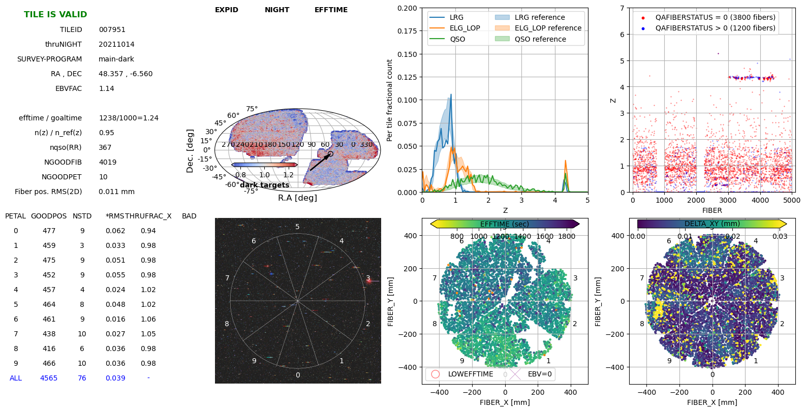

**Note**: the missing fibers 750-999 and 2000-2249 in petals 1 and 4 are because
we purposefully disabled two CCD amps due to known readout problems on that night.
In this tutorial we will inspect the bogus z~4.3 redshifts on fibers 3000-4500
which was a new and unexpected problem.

## Underlying cause

The QA plot shows that there *is* a problem; now we want to find the *cause*
of the problem.  Several possibilities (in general), in order of data flow:

  1. fundamentally bad/corrupted raw data
  2. light contamination, e.g. scattered light from a bright star or a light left on in the dome
  3. bad CCD calibrations used during raw data preprocessing
  4. bad spectrograph PSF model leading to incorrect spectra extracted from CCD
  5. bad fiberflat
  6. bad sky subtraction
  7. bad flux calibration
  
There are 500 fibers per spectrograph/petals,
i.e. petal = spectrograph = fiber//500, so fibers 3000-4499 are petals 6-8.
There is nothing obviously wrong with these petals in the imaging cutout,
the EFFTIME (effective exposure time) plot, nor the DELTA_XY (fiber positioning)
plot, except for the patch of bad positioning that looks like one CANbus of
fibers failing to move correctly (50 fibers), while we're chasing a bigger
problem here.

Ruling out several of the possibilities straight away:

  * light contamination in the dome would affect all petals roughly equally,
    while this problem is localized to a specific range of fibers so that is unlikely.
  * Although there is a bright star just off of petal 3, scattered light is more
    localized and doesn't care about petal boundaries, while this problem seems
    to be 3 specific spectrographs: 6,7,8 covering fibers 3000 - 4499.
  * PSF and fiberflat calibrations come from arc and flat exposures at the
    beginning of the night and are used for all exposures on that night, so if
    they have a problem all tiles on that night would be impacted similarly.
    
**Note**: because the tile QA are grouped by TILEID/NIGHT instead of NIGHT/TILEID
it isn't easy to browse the QA files for all tiles on a night, but you can find
them on disk with:
```
cd /global/cfs/cdirs/desi/spectro/redux/dataqa-tutorial/tiles/cumulative
ls */20211014/tile-qa*.png
```
And then prefix those with https://data.desi.lbl.gov/desi/spectro/redux/dataqa-tutorial/tiles/cumulative
to find their URL, e.g.

https://data.desi.lbl.gov/desi/spectro/redux/dataqa-tutorial/tiles/cumulative/1298/20211014/tile-qa-1298-thru20211014.png
https://data.desi.lbl.gov/desi/spectro/redux/dataqa-tutorial/tiles/cumulative/6699/20211014/tile-qa-6699-thru20211014.png

Those don't show the z~4.3 problem, thus the problem is related to the exposures
for that tile, not calibrations across the entire night
(PSF, fiberflat, or CCD bias+dark).

So that leaves options (1) bad data, (6) bad sky subtraction, or (7) bad flux calibration.

## Looking at spectra

Let's identify some example TARGETID in the set of high-z QSOs:
```
$> ipython
Python 3.8.3 (default, May 19 2020, 18:47:26) 
Type 'copyright', 'credits' or 'license' for more information
IPython 7.16.1 -- An enhanced Interactive Python. Type '?' for help.

In [1]: from astropy.table import Table                                         

In [2]: redrock = Table.read('redrock-6-7951-thru20211014.fits', 'REDSHIFTS')   

In [3]: ii = redrock['Z']>4                                                     

In [4]: redrock['TARGETID', 'SPECTYPE', 'Z'][ii]                                
Out[4]: 
<Table length=106>
     TARGETID      SPECTYPE         Z        
      int64         bytes6       float64     
------------------ -------- -----------------
 39627652809627006      QSO 4.359790133637829
 39627652801234874      QSO  4.36135350633215
 39627652809626531      QSO 4.378768427751082
...
```

Let's look at some example spectra:
```
cd /global/cfs/cdirs/desi/spectro/redux/dataqa-tutorial/tiles/cumulative/7951/20211014
plot_spectra -i coadd-6-7951-thru20211014.fits --rebin 5 -t 39627652809627006
plot_spectra -i coadd-6-7951-thru20211014.fits --rebin 5 -t 39627652801234874
plot_spectra -i coadd-6-7951-thru20211014.fits --rebin 5 -t 39627652809626531
```

Those all show a negative dip in the middle of the R-camera that redrock is
probably incorrectly fitting as negative Lyman-alpha, i.e.
(6500-1218)/1218 ~ 4.3 .  Problems in the middle of a camera could be related
to the CCD amplifier boundaries in the middle of the CCD, but that more likely
creates a step rather than a uniform dip, and we'd need to check whether this
feature really is centered on the middle of the CCD
(the wavelength -> row mapping varies with fiber number).

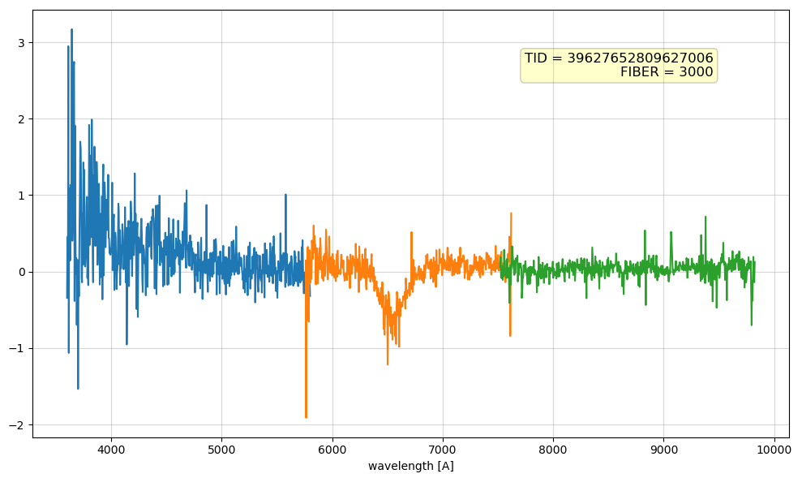

**Help Wanted**: `plot_spectra` currently takes a list of TARGETIDs, but
in this case it would have been helpful to specify some random FIBERs to inspect.
That wouldn't apply to healpix-based coadds, but would have been handy here.

**Help Wanted**: `plot_spectra -i coadd-6-7951-thru20211014.fits --spectype QSO`
plots blank spectra.  Fix that.

**Help Wanted**: `plot_spectra -i coadd-6-7951-thru20211014.fits --redrock redrock-0-7951-thru20211014.fits --rebin 5 -t 39627652801234874
` is broken.  Fix that.

## Input exposures

Now that we've identified that the problem is on the r-camera, let's look at
individual frames (spectra from one camera from one exposure).

**Option 1**: Use nightwatch.desi.lbl.gov and browse to 20211014 and find what
exposures covered tile 7951.

**Option 2**: grep the daily exposures file:
```
cd /global/cfs/cdirs/desi/spectro/redux/dataqa-tutorial
grep 7951 tsnr-exposures.csv
```
Caveat: `tsnr-exposures.csv` will be renamed to `exposures-daily.csv` at some
point in the future to match the mountain production runs.

**Option 3**: if the production exposures table hasn't yet been updated by the
daily cronjob, you can also check the per-night exposures table used for the
pipeline processing:
```
cd /global/cfs/cdirs/desi/spectro/redux/dataqa-tutorial
grep 7951 exposure_tables/202110/exposure_table_20211014.csv
```
Caveat: those will likely become .ecsv instead of .csv soon...

Any of those options identify that tile 7951 on night 20211014 was observed with
exposure IDs 104284 and 104285.

## Inspecting frames

The daily pipeline produces several flavors of frame files with 500 spectra each:
  * frame: raw uncalibrated extracted electrons/Angstrom
  * sframe: fiber-flatfielded sky-subtracted electrons/Angstrom
  * cframe: fiber-flatfielded sky-subtracted flux-calibrated 10e-17 ergs/s/cm2/Angstrom
  
Let's look at the sframe files:
```
cd /global/cfs/cdirs/desi/spectro/redux/dataqa-tutorial/exposures/20211014
ds9 -zscale 00104284/sframe-r6-*.fits
```
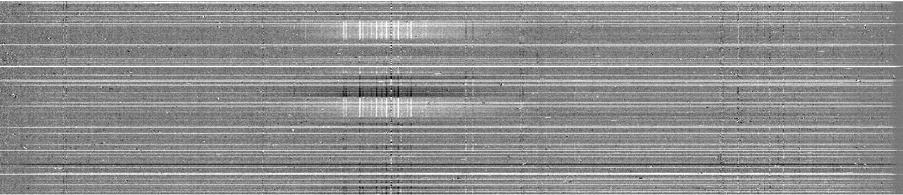

In these images there is one row per fiber, and columns are different wavelengths.
Vertical lines indicate problems at a particular wavelength (e.g. sky subtraction
or flux calibration).  It is normal to have extra noise in vertical stripes due
to poisson noise from sky emission subtraction, but there shouldn't be systematic
dark or bright vertical lines.

In this case, there are both dark and bright lines for a subset of fibers,
and around those regions a broader excess/deficit of light.

**Note**: Since the mapping of wavelength -> CCD row varies with fiber number, problems
at the CCD level typically show up as curved features in these sframe images,
which is not the case for this image of r6.  Compare that with camera r8 which
has known amplifier A CCD problems:
```
ds9 -zscale 00104284/sframe-r8-*.fits
```
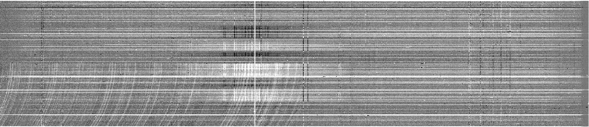
That has both curved and vertical structures, indicating both CCD-level problems
and downstream processing problems.  Ugh.

Let's go back to r6.  The vertical structures are ~50 fibers each, which is
one of the magic numbers to look for:
50 localized fibers on the focal plane map to 50 neighboring fibers on the CCD,
with the next group of 50 purposefully going to a non-adjacent part of the
focalplane.  So several disjoint groups of 50 on the CCD *could* be a localized
part of the focal plane.  I had previously discounted the possibility of
scattered light because the problem seemed to impact exactly 3 petals, but now
I'm less sure.  We'll come back to investigate this.

Frame r6-104285 (same camera, next exposure) shows similar but not identical structures.
r7 frames have different fibers that are impacted, again in groups of ~50 fibers:
```
ds9 -zscale 00104284/sframe-r[67]-*.fits 00104285/sframe-r[67]-*.fits
```

sframe-r6-00104285:


sframe-r7-00104284:
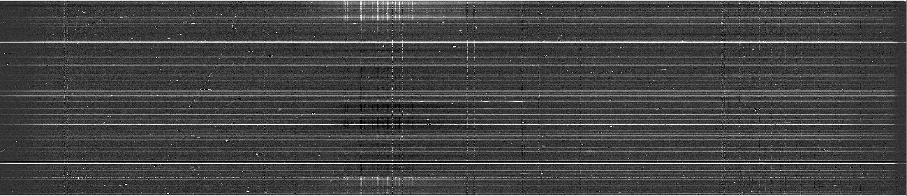

Let's compare to the non-sky-subtracted raw r6 frames:
```
ds9 -zscale 00104284/frame-r6-*.fits 00104284/sframe-r6-*.fits
```
I didn't include screen shots here, but blinking those shows that the
vertical lines are from sky fibers, but it isn't
clear why only some sky lines for only some fibers are impacted.

Another cross check: what did the exposures immediately before and after this
tile look like?  i.e. is the problem unique to this tile, or did some hardware
problem appear?  Picking the before/after exposures from https://nightwatch.desi.lbl.gov/20211014/exposures.html :
```
ds9 -zscale 00104282/sframe-r6-*.fits
ds9 -zscale 00104286/sframe-r6-*.fits
```

sframe-r6-00104282 (just before the problem tile exposures):
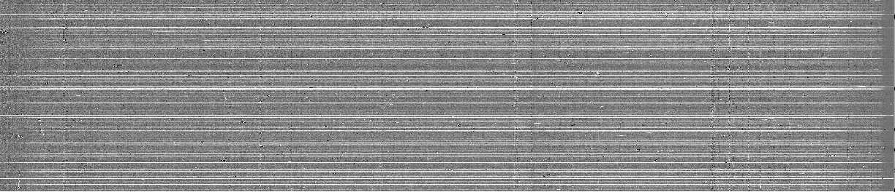

sframe-r6-00104286 (just after the problem tile exposures):
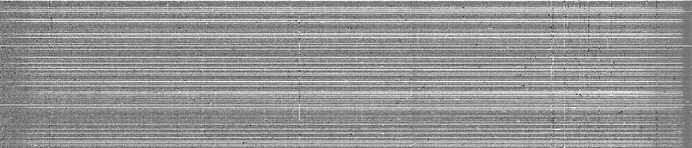

Both of those look pretty good compared to 104284 and 104285.  i.e. the problem
appears specific to tile 7951, since it impacts both exposures for that tile but
not the exposures before and after.

## Sky-subtracted sky fibers

Looking back at the tile QA plots, there is a pretty bright star on r6 which
could be causing localized sky subtraction problems for neighboring fibers.
To inspect the sky-subtracted sky-fibers for a particular frame:
```
plot_frame -i 00104284/sframe-r6-*.fits --sky-fibers --rebin 10
```
there is clearly a broad sky subtraction problem around 6600 Angstroms:
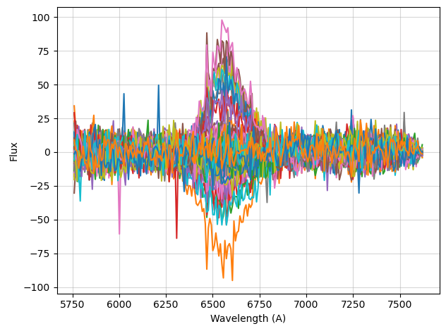

That does *not* look like contamination from a star, but it does look
like the dip in the "QSO z~4.3" spectrum we first inspected, and it looks
suspiciously like the spectrum of a red LED.

**Note**: Scattered light contamination in some-but-not-all sky fibers
results in an average model where some are under-subtracted and others are
over-subtracted, like we see here.  Looking back at the sframe images, the
bigger issue seems to be the broad over/under subtraction, not the individual
sky lines that originally drew our attention.

## Summary so far

The problem is with sky subtraction.  It's not due to flux calibration since
the problems appear pre-fluxcalib in the sframe files, and isn't a
CCD-level issue since it is localized in wavelength rather than CCD rows
which would appear curved in the sframe images.  Localized scattered light
from a red LED is the leading hypothesis.

Outstanding questions:
  * why are there problems on 3 cameras and not more or less?
  * why those fibers, e.g. are they localized on focal plane?
  * if it is an LED, why was it on (or scattering into focalplane) only for
    that tile?  Scattered light from a star would be easier to explain.

## Sky level vs. focal plane location

Let's plot the variation in spectra from 6500-6700 vs. focal plane location,
for both fiber-flatfieled raw spectra (including sky), and sky-subtracted
spectra.  Summary of the following code:
  * read each raw frame and sky-subtracted sframe
  * correct raw frames with fiberflatfield for variations in individual fiber
    throughput and input size
  * calculate the median flux from 6500-6700 Angstroms for each fiber
  * plot the residuals of each fiber wrt the median of the medians

```
cd /global/cfs/cdirs/desi/spectro/redux/dataqa-tutorial
ipython --pylab
```

```python
import os
import numpy as np
import fitsio
import desispec.io
from desispec.fiberflat import apply_fiberflat
from desispec.calibfinder import CalibFinder

night, expid = 20211014, 104284
x = list()
y = list()
sky = list()
skysub = list()
for petal in range(10):
    camera = 'r'+str(petal)
    framefile = f'exposures/{night}/{expid:08d}/frame-{camera}-{expid:08d}.fits'
    sframefile = f'exposures/{night}/{expid:08d}/sframe-{camera}-{expid:08d}.fits'
    fiberflatfile = f'calibnight/{night}/fiberflatnight-{camera}-{night}.fits'

    frame = desispec.io.read_frame(framefile)
    sframe = desispec.io.read_frame(sframefile)
    
    #- raw frames need to be fiberflat fielded to adjust for individual fiber
    #- input sizes and throughputs.  However, bad amps on r1 and r4 removed
    #- them from nightly flat so get default fiberflat instead
    if not os.path.exists(fiberflatfile):
        cx = CalibFinder([frame.meta,])
        fiberflatfile = fiberflatfile = cx.findfile('FIBERFLAT')

    fiberflat = desispec.io.read_fiberflat(fiberflatfile)
    apply_fiberflat(frame, fiberflat)
        
    skyfibers = frame.fibermap['OBJTYPE'] == 'SKY'
    skyfibers = np.ones(500, dtype=bool)
    ii = (6500 < frame.wave) & (frame.wave < 6700)
    x.extend(frame.fibermap['FIBER_X'][skyfibers])
    y.extend(frame.fibermap['FIBER_Y'][skyfibers])
    
    sky.extend(np.median(frame.flux[skyfibers][:, ii], axis=1))
    skysub.extend(np.median(sframe.flux[skyfibers][:, ii], axis=1))

figure(figsize=(8.5,4))
subplot(121)
medsky = np.median(sky)
scatter(x, y, c=sky, s=5, vmin=medsky-20, vmax=medsky+20, cmap='RdBu')
title('flat-fielded raw spectra residuals')

subplot(122)
scatter(x, y, c=skysub, s=5, vmin=-20, vmax=+20, cmap='RdBu')
title('sky-subtracted spectra residuals')
```

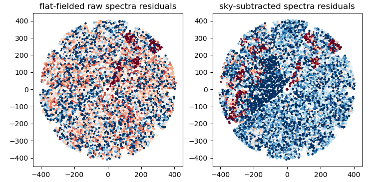

**Note**: ignore the patches on petal 4 (upper right); those are the bad
amp that are excluded from the original tile QA plot at the top.  Focus
on petals 6,7,8 on the left side of each focalplane plot.

There isn't any obvious structure in the raw spectra that would lead to
the structure in the sky subracted spectra.  Maybe there is something wrong
in the sky model itself, rather than in the data?

```
cd /global/cfs/cdirs/desi/spectro/redux/dataqa-tutorial
ds9 -zscale exposures/20211014/00104284/sky-r6-*.fits
```
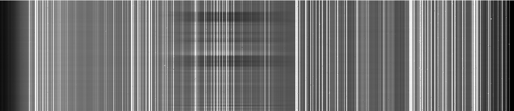

Whoa -- something is wrong here.  They sky model itself is introducing the
~6600 Angstrom feature, rather than it being an average sky with
minor fiber-to-fiber PSF resolution and achromatic throughput variations.
I guess it's not a red LED after all.

## Time to call Julien

Stephen called Julien and showed him that sky model plot and confirmed that
the sky model isn't supposed to have that amount of flexibility.  Within
30 minutes Julien had debugged the root cause and fixed it with
[desispec PR #1452](https://github.com/desihub/desispec/pull/1452).

It's still unclear what the feature is for that tile that causes this bug
to be triggered here and not elsewhere.

## Before / After

With the sky model fix from Julien in [PR #1452](https://github.com/desihub/desispec/pull/1452),
some before/after comparisons:

#### sky-r6-00104284 before (left) vs. after (right):
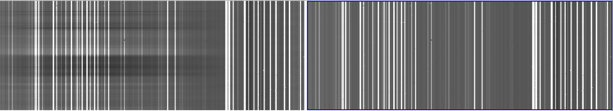

#### sframe-r6-00104284 before (left) vs. after (right):
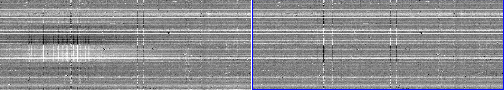

There are still some pretty strong sky residuals to investigate, but it is
much improved.

#### Updated tile QA

Yay! the z~4.3 QSO excess is gone:

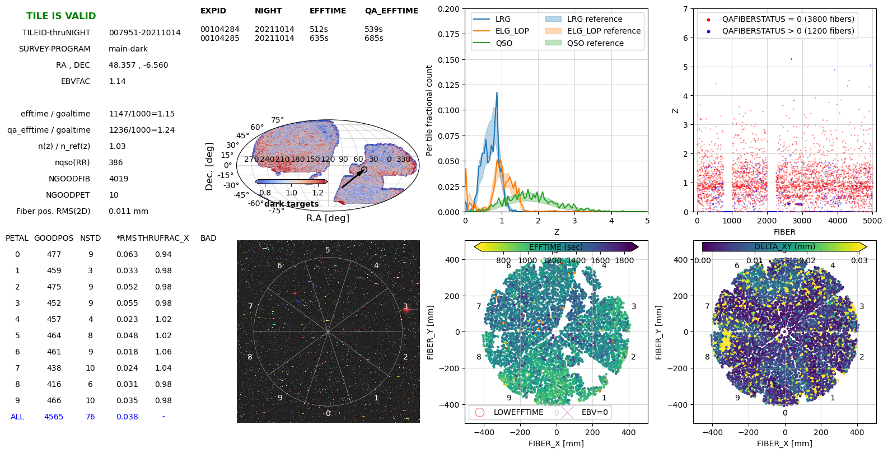

## Epilogue

A key part of data QA debugging is to identify whether the core problem is
a CCD / raw data corruption issue, or a processing issue. If a processing issue,
identify what is the first step where the problem appears.  Viewing [s]frame
files and sky files (and cframe and fluxcalib) with ds9 is a remarkably useful
tool for quickly identifying if the problem is constant with wavelength
(vertical features), constant with CCD row (curved features), and/or isolated
to a few spectra or many and how they are grouped.

In this case I fairly quickly identified the problem as sky subtraction or
non-uniform scattered/contamination light, but I chased several false leads
(red LED, bright star) on the way to the final solution.  In the end, it
appears that non-uniform H-alpha etc lines was triggering a broader sky
subtraction bug that led to the redrock z~4.3 failures.

## Appendix: sky line residuals vs. xy

Although the problem didn't turn out to be light contamination from a red LED,
something is still going on with those mis-subtracted sky lines.  I made an
updated version of the above "blat vs. xy" code with a much narrower wavelength
slice focusing on individual lines:

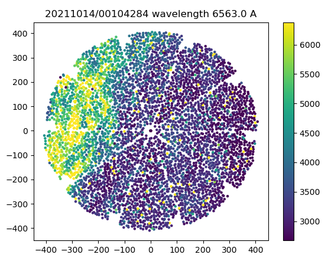

For a few particular lines, there is clear structure on the focal plane that
current sky subtraction can't model.

## Appendix: Bright star
 
The problem also wasn't from a bright star, but a few tips for how to
investigate that:
 
Grabbing ra=48.357, dec=-6.56 from the original QA plot, we can go to the
legacy surveys viewer and turn on the DESI footprint, DESI fibers, and Bright Stars:
 
https://www.legacysurvey.org/viewer?ra=48.357&dec=-6.56&layer=ls-dr9&zoom=12

HR 983 is a 6th magnitude star near fiber 3348.

