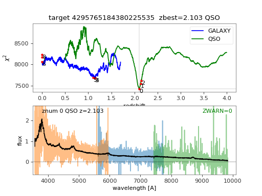

# Redrock plotspec

This page documents how to run `rrplot` viewer to get plots like:



It allows you to explore the chi2 vs. redshift scans and the N best fits
for each spectrum.

## Installation

Install the redrock + desispec code into an isolated conda environment:
```
conda create -n rrdesi python=3 numpy scipy astropy numba ipython h5py matplotlib pyyaml
pip install speclite
source activate rrdesi

git clone https://github.com/desihub/redrock-templates
git clone https://github.com/desihub/redrock
git clone https://github.com/desihub/desiutil
git clone https://github.com/desihub/desispec

for repo in desiutil desispec redrock; do
    cd $repo
    python setup.py install
    cd ..
done

export RR_TEMPLATE_DIR=$(pwd)/redrock-templates
```

## Get example data

Available from NERSC at
```
/project/projectdirs/desi/datachallenge/dc17a-twopct/dc17a-lite.tar.gz
```

## Run rrplot

First go to the top level directory where you have those files.

It might work for you to run `rrplot` from the command line, e.g.
```
specdir=spectro/redux/dc17a2/spectra-64/172/17242/
rrplot --specfile $specdir/spectra* --rrfile $specdir/r*.h5
```

For some people, this flashes a matplotlib window and immediately exits.
In that case, you need to spawn it from within an `ipython --pylab` session:

```
#- Find where you installed rrplot
import os
rrplot = None
for p in os.environ['PATH'].split(':'):
    rrplot = os.path.join(p, 'rrplot')
    if os.path.exists(rrplot):
        break

if rrplot is None:
    print('ERROR: unable to find rrplot in your $PATH')
else:
    print('Using '+rrplot)

#- Input files
specfile = 'spectro/redux/dc17a2/spectra-64/172/17242/spectra-64-17242.fits'
rrfile = 'spectro/redux/dc17a2/spectra-64/172/17242/rr-64-17242.h5'

#- Now actually run it
%run $rrplot --specfile $specfile --rrfile $rrfile
```

